# Quantum Fourier Transformation


* [Qiskit Chapter on QFT](https://qiskit.org/textbook/ch-algorithms/quantum-fourier-transform.html#qfteqn)
* [QFT vizualization made easy](https://algassert.com/quirk)


## Some definition

The discrete Fourier transform acts on a vector $(x_0, ..., x_{N-1})$ and maps it to the vector $(y_0, ..., y_{N-1})$ according to the formula


$$y_k = \frac{1}{\sqrt{N}}\sum_{j=0}^{N-1}x_j\omega_N^{jk}$$


where $\omega_N^{jk} = e^{2\pi i \frac{jk}{N}}$.

Similarly, the quantum Fourier transform acts on a quantum state $\sum_{i=0}^{N-1} x_i \vert i \rangle$ and maps it to the quantum state $\sum_{i=0}^{N-1} y_i \vert i \rangle$ according to the formula


$$y_k = \frac{1}{\sqrt{N}}\sum_{j=0}^{N-1}x_j\omega_N^{jk}$$


with $\omega_N^{jk}$ defined as above. Note that only the amplitudes of the state were affected by this transformation.

This can also be expressed as the map:


$$\vert x \rangle \mapsto \frac{1}{\sqrt{N}}\sum_{y=0}^{N-1}\omega_N^{xy} \vert y \rangle$$


Or the unitary matrix:


$$ U_{QFT} = \frac{1}{\sqrt{N}} \sum_{x=0}^{N-1} \sum_{y=0}^{N-1} \omega_N^{xy} \vert y \rangle \langle x \vert$$


## Example 1: 1-qubit QFT

Consider how the QFT operator as defined above acts on a single qubit state $\vert\psi\rangle = \alpha \vert 0 \rangle + \beta \vert 1 \rangle$. In this case, $x_0 = \alpha$, $x_1 = \beta$, and $N = 2$. Then,


$$y_0 = \frac{1}{\sqrt{2}}\left(    \alpha \exp\left(2\pi i\frac{0\times0}{2}\right) + \beta \exp\left(2\pi i\frac{1\times0}{2}\right)      \right) = \frac{1}{\sqrt{2}}\left(\alpha + \beta\right)$$


and


$$y_1 = \frac{1}{\sqrt{2}}\left(    \alpha \exp\left(2\pi i\frac{0\times1}{2}\right) + \beta \exp\left(2\pi i\frac{1\times1}{2}\right)      \right) = \frac{1}{\sqrt{2}}\left(\alpha - \beta\right)$$


such that the final result is the state 


$$U_{QFT}\vert\psi\rangle = \frac{1}{\sqrt{2}}(\alpha + \beta) \vert 0 \rangle + \frac{1}{\sqrt{2}}(\alpha - \beta)  \vert 1 \rangle$$


This operation is exactly the result of applying the Hadamard operator ($H$) on the qubit:


$$H = \frac{1}{\sqrt{2}}\begin{bmatrix} 1 & 1 \\ 1 & -1 \end{bmatrix}$$


If we apply the $H$ operator to the state $\vert\psi\rangle = \alpha \vert 0 \rangle + \beta \vert 1 \rangle$, we obtain the new state:

$$\frac{1}{\sqrt{2}}(\alpha + \beta) \vert 0 \rangle + \frac{1}{\sqrt{2}}(\alpha - \beta)  \vert 1 \rangle 
\equiv \tilde{\alpha}\vert 0 \rangle + \tilde{\beta}\vert 1 \rangle$$

Notice how the Hadamard gate performs the discrete Fourier transform for $N = 2$ on the amplitudes of the state. 

## 5. The Circuit that Implements the QFT 


The circuit that implements QFT makes use of two gates. The first one is a single-qubit Hadamard gate, $H$. The second is a two-qubit controlled rotation $CROT_k$.


Given these two gates, a circuit that implements **an n-qubit QFT** is shown below.


The circuit operates as follows. We start with an n-qubit input state $\vert x_1x_2\ldots x_n\rangle$.

<ol>
<li> After the first Hadamard gate on qubit 1, the state is transformed from the input state to 

$$
H_1\vert x_1x_2\ldots x_n\rangle = 
\frac{1}{\sqrt{2}}
\left[\vert0\rangle + \exp\left(\frac{2\pi i}{2}x_1\right)\vert1\rangle\right]
\otimes
\vert x_2x_3\ldots x_n\rangle
$$

<li> After the $UROT_2$ gate on qubit 1 controlled by qubit 2, the state is transformed to

$$
\frac{1}{\sqrt{2}}
\left[\vert0\rangle + \exp\left(\frac{2\pi i}{2^2}x_2 + \frac{2\pi i}{2}x_1\right)\vert1\rangle\right]
\otimes
\vert x_2x_3\ldots x_n\rangle
$$
    
Note in the bracket that the value of k is 2 (hence $2^2$) in the case of $x_2$ and 1 (hence $2^1$) for the case of $x_1$.

<li> After the application of the last $UROT_n$ gate on qubit 1 controlled by qubit $n$, the state becomes

$$
\frac{1}{\sqrt{2}}
\left[\vert0\rangle + 
\exp\left(
\frac{2\pi i}{2^n}x_n + 
\frac{2\pi i}{2^{n-1}}x_{n-1} + 
\ldots + 
\frac{2\pi i}{2^2}x_2 + 
\frac{2\pi i}{2}x_1
\right)
\vert1\rangle\right]
\otimes
\vert x_2x_3\ldots x_n\rangle
$$

Noting that 

$$
x = 2^{n-1}x_1 + 2^{n-2}x_2 + \ldots + 2^1x_{n-1} + 2^0x_n
$$

we can write the above state as 

$$
\frac{1}{\sqrt{2}}
\left[\vert0\rangle + 
\exp\left(
\frac{2\pi i}{2^n}x 
\right)
\vert1\rangle\right]
\otimes
\vert x_2x_3\ldots x_n\rangle
$$

<li> After the application of a similar sequence of gates for qubits $2\ldots n$, we find the final state to be:

$$
\frac{1}{\sqrt{2}}
\left[\vert0\rangle + 
\exp\left(
\frac{2\pi i}{2^n}x 
\right)
\vert1\rangle\right]
\otimes
\frac{1}{\sqrt{2}}
\left[\vert0\rangle + 
\exp\left(
\frac{2\pi i}{2^{n-1}}x 
\right)
\vert1\rangle\right]
\otimes
\ldots
\otimes
\frac{1}{\sqrt{2}}
\left[\vert0\rangle + 
\exp\left(
\frac{2\pi i}{2^{2}}x 
\right)
\vert1\rangle\right]
\otimes
\frac{1}{\sqrt{2}}
\left[\vert0\rangle + 
\exp\left(
\frac{2\pi i}{2^{1}}x 
\right)
\vert1\rangle\right]
$$

which is exactly the QFT of the input state as derived above with the caveat that the order of the qubits is reversed in the output state.
</ol>

## 6. Example 2: 1-qubit QFT


## Qiskit Implementation


```python
import numpy as np
import pylab as plt

from qiskit import QuantumCircuit, execute, Aer, IBMQ
from qiskit.visualization import plot_histogram, plot_bloch_multivector

```


```python
qc = QuantumCircuit(3)
```

**Note**: Remember that Qiskit's least significant bit has the lowest index (0), thus the circuit will be mirrored through the horizontal in relation to the image in section 5. First, we apply a H-gate to qubit 2 :


```python
qc.h(2)
qc.draw('mpl')
```


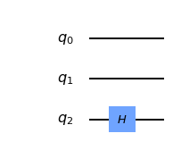


```python
# UROT_2 gate to x1 depending on x2

from numpy import pi
qc.cu1(pi/2, 1, 2) # CROT from qubit 1 to qubit 2 hence the angle: pi/2^{2-1}
qc.draw('mpl')
```


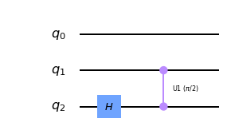


```python
qc.cu1(pi/4, 0, 2) # CROT from qubit 2 to qubit 0 hence the angle: pi/2^{2-0}
qc.draw('mpl')
```


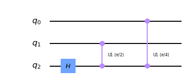


```python
# Repeat the process for 2 and 3 
qc.h(1)  # Hadamard on 1
qc.cu1(pi/2, 0, 1) # CROT from qubit 0 to qubit 1 hence the angle: pi/2^{1-0}
qc.h(0)  # Hadamard on 0
qc.draw('mpl')
```


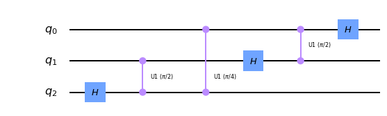


```python
# Now swap the qubit 0 and 2 to complete QFT. [NOT CLEAR TO ME]
qc.swap(0,2)
qc.draw('mpl')
```


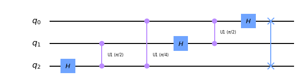


## General QFT Function


```python
def qft_rotations(ckt, n):
    if n == 0:
        return ckt
    n -= 1
    ckt.h(n)
    for qubit in range(n):
        ckt.cu1( pi/2**(n-qubit), qubit, n )

qc = QuantumCircuit(4)
qft_rotations(qc,4)
qc.draw('mpl')
```


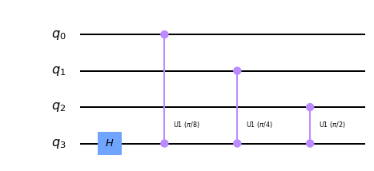


```python
def qft_rotations(ckt, n):
    if n == 0:
        return ckt
    n -= 1
    ckt.h(n)
    for qubit in range(n):
        ckt.cu1( pi/2**(n-qubit), qubit, n )
        
    qft_rotations(ckt, n)
        
qc = QuantumCircuit(4)
qft_rotations(qc,4)
qc.draw('mpl')
```


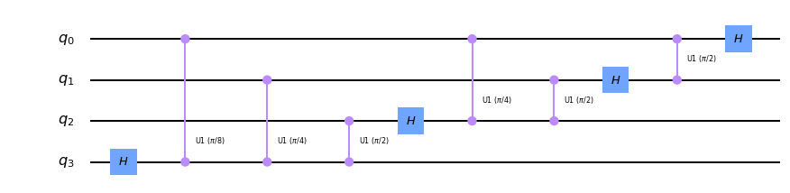


```python
from qiskit_textbook.widgets import scalable_circuit
scalable_circuit(qft_rotations)
```


    IntSlider(value=4, max=8, min=1)


    Image(value=b'\x89PNG\r\n\x1a\n\x00\x00\x00\rIHDR\x00\x00\x04u\x00\x00\x01\x08\x08\x06\x00\x00\x00\xd1\x16\xc8…


```python
def swap_registers(ckt, n):
    for qubit in range(n//2):
        ckt.swap(qubit, n-qubit-1)
    return ckt

def qft(ckt, n):
    qft_rotations(ckt, n)
    swap_registers(ckt, n)
    return ckt

qc = QuantumCircuit(4)
qft(qc, 4)
qc.draw('mpl')
```


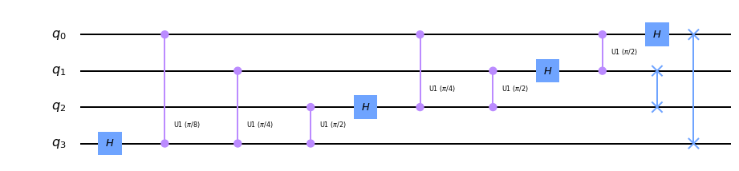


## Testing the Circuit


```python
print (f"5 and it's binary: {bin(5)}")
#bin(9)
```

    5 and it's binary: 0b101


```python
qc = QuantumCircuit(3)
qc.x(0)
qc.x(2)
qc.draw('mpl')
```


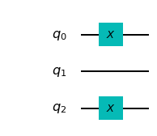


```python
backend = Aer.get_backend('statevector_simulator')
sv = execute(qc, backend=backend).result().get_statevector()
plot_bloch_multivector(sv)
print (sv.real)
```

    [0. 0. 0. 0. 0. 1. 0. 0.]


```python
qft(qc, 3)
qc.draw('mpl')
```


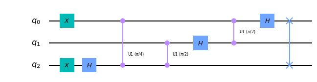


```python
sv = execute(qc, backend=backend).result().get_statevector()
plot_bloch_multivector(sv)

```


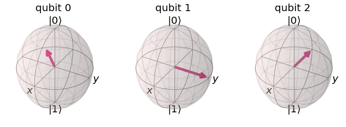


```python
print ('The statevectors are:\n', sv.round(1))
print ('Angle subtended by each states (as a factor of pi):\n',(np.angle(sv)/np.pi).round(2))

```

    The statevectors are:
     [ 0.4-0.j  -0.3-0.2j  0. +0.4j  0.2-0.3j -0.4+0.j   0.3+0.2j -0. -0.4j
     -0.2+0.3j]
    Angle subtended by each states (as a factor of pi):
     [-0.   -0.75  0.5  -0.25  1.    0.25 -0.5   0.75]


We can see out QFT function has worked correctly. Compared the the state  $\vert 0 \rangle= \vert+++\rangle$ , Qubit $0$ has been rotated by  $5/8$  of a full turn, qubit $1$ by  $10/8$  full turns (equivalent to  $1/4$  of a full turn), and qubit $2$ by  $20/8$  full turns (equivalent to  $1/2$  of a full turn).

## Inverse Fourier Transform


```python
def inverse_qft(circuit, n):
    """Does the inverse QFT on the first n qubits in circuit"""
    # First we create a QFT circuit of the correct size:
    qft_circ = qft(QuantumCircuit(n), n)
    # Then we take the inverse of this circuit
    invqft_circ = qft_circ.inverse()
    # And add it to the first n qubits in our existing circuit
    circuit.append(invqft_circ, circuit.qubits[:n])
    # use .decompose() which allows us to see the individual gates
    return circuit.decompose() 

```


```python
nqubits = 3
number = 6
qc = QuantumCircuit(nqubits)
for qubit in range(nqubits):
    qc.h(qubit)
qc.u1(number*pi/4,0)
qc.u1(number*pi/2,1)
qc.u1(number*pi,2)

qc.draw('mpl')
```


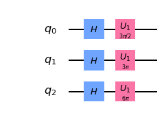


```python
backend = Aer.get_backend("statevector_simulator")
sv = execute(qc, backend=backend).result().get_statevector()
plot_bloch_multivector(sv)

```


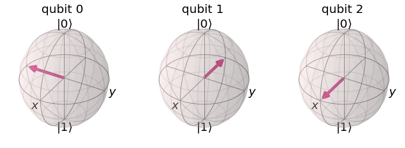


```python

print ('The statevectors are:\n', sv.round(1))
print ('Angle subtended by each states (as a factor of pi):\n',(np.angle(sv)/np.pi).round(2))

```

    The statevectors are:
     [ 0.4+0.j  -0. -0.4j -0.4+0.j   0. +0.4j  0.4+0.j  -0. -0.4j -0.4+0.j
      0. +0.4j]
    Angle subtended by each states (as a factor of pi):
     [ 0.  -0.5  1.   0.5  0.  -0.5  1.   0.5]


```python
qc = inverse_qft(qc,nqubits)
qc.measure_all()
qc.draw('mpl')
```


### Error on IBMQ load account

* https://www.ibm.com/cloud/blog/how-to-resolve-a-401-unauthorised-error-in-ibm-watson

I did add the ibm cloud account here and added the ibm watson assistant which is free. learn now how to add the credential here on the terminal/jupyter notebook.

https://cloud.ibm.com/services/conversation/crn%3Av1%3Abluemix%3Apublic%3Aconversation%3Aau-syd%3Aa%2F81a5dba8ddf7472c97dd3bb499e55b05%3A06bd131c-12c4-435a-8fee-ad14d570790d%3A%3A?paneId=manage&new=true


```python
backend = Aer.get_backend("qasm_simulator")

shots = 2048
job = execute(qc, backend=backend, shots=shots, optimization_level=3)

counts = job.result().get_counts()
plot_histogram(counts)
```


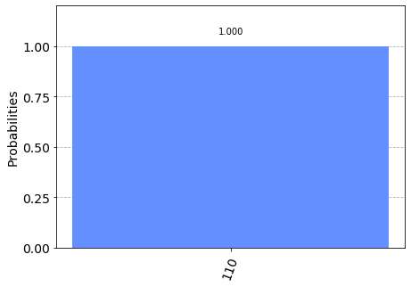


## Something more on Fourier Transform

* [Circuit Sessions with Ali Javadi (YouTube)](https://www.youtube.com/watch?v=SsXJgAZ6aIg&feature=share&fbclid=IwAR2b6_DRIxfy9L7rH0bVIAb7ZGB1S32l7lx8ZS8Df2sSWLJ0kjK6YW1_1HA)


```python
from qiskit import circuit, quantum_info

num_qubits = 6
qft = circuit.library.QFT(num_qubits, approximation_degree=0, insert_barriers=False)
qft.draw('mpl', fold=500, reverse_bits = True)

```


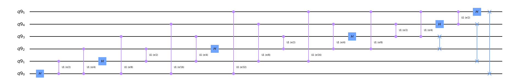


```python
# Plot classical vs. quantum Fourier transform, for all basis states..
# By linearity of Fourier transform, all states map correctly.
# The difference in height is due to normalization in quantum.

plt.figure(figsize=(16,16))
for i, basis_state in enumerate([0, 1, 2, 3]):
    state = quantum_info.Statevector.from_int(basis_state, dims=2**num_qubits)
    #print (state)
    classical_fourier = np.fft.ifft(state.data)      # classical library function
    quantum_fourier = state.evolve(qft).data         # quantum library (simulation via quantum_info)

    width = 0.5
    
    #fig.suptitle('Input State: ' + str(basis_state), fontsize=16)
    
    plt.subplot(4,2, 2*i+1)
    plt.title('state: %1i real'%i)
    plt.bar(np.arange(2**num_qubits)-width/2., classical_fourier.real, width,  label='classical')
    plt.bar(np.arange(2**num_qubits)+width/2., quantum_fourier.real, width, label='quantum')
    plt.legend(frameon=False)
    
    plt.subplot(4,2, 2*i+2)
    plt.title('state: %1i Imaginary part'%i)
    plt.bar(np.arange(2**num_qubits)-width/2., classical_fourier.imag, width, label='classical')
    plt.bar(np.arange(2**num_qubits)+width/2., quantum_fourier.imag, width, label='quantum')
    plt.legend(frameon=False)


```


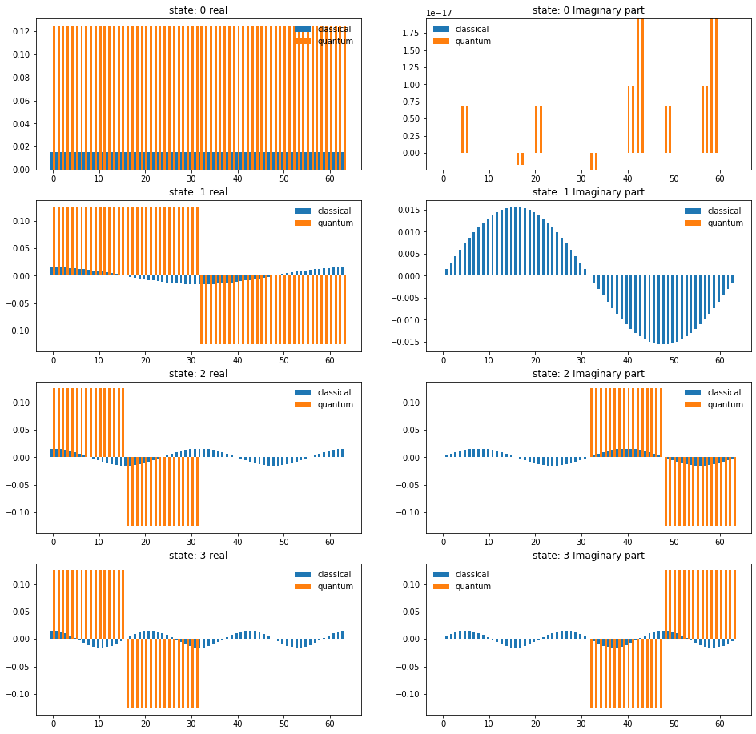


```python
import matplotlib.pyplot as plt

Nt = 256
t = np.arange(Nt)
fft = np.fft.fft(np.sin(t))
ifft = np.fft.ifft(np.sin(t))
freq = np.fft.fftfreq(Nt)

plt.figure(figsize=(16,4))
plt.subplot(121)
plt.title('real')
plt.plot(freq, fft.real, '-o', label='fft (real)')
plt.plot(freq, Nt*ifft.real, '-o', label='Nt * ifft (real)')
plt.legend(fontsize='large')
plt.xlabel('frequency', fontsize='large')

plt.subplot(122)
plt.title('imag')
plt.plot(freq, fft.imag, '-o', label='fft (imag)')
plt.plot(freq, Nt*ifft.imag, '-o', label='Nt * ifft (imag)')
plt.legend(fontsize='large')
plt.xlabel('frequency', fontsize='large')

plt.show()
```


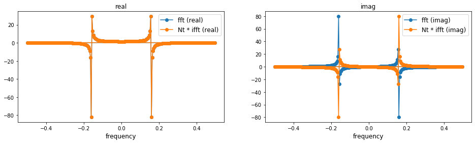


```python
from qiskit import circuit, quantum_info

num_qubits = 6
qft = circuit.library.QFT(num_qubits, insert_barriers=False)
qft.draw('mpl', fold=500, reverse_bits = True)

basis_state = 2
state = quantum_info.Statevector.from_int(basis_state, dims=2**num_qubits)
quantum_fourier = state.evolve(qft).data

width = 0.5

plt.subplot(121)
plt.bar(np.arange(2**num_qubits)+width/2., quantum_fourier.real, width, label='real')

plt.subplot(122)
plt.bar(np.arange(2**num_qubits)+width/2., quantum_fourier.imag, width, label='imag')
plt.legend(frameon=False)

```


    <matplotlib.legend.Legend at 0x12bafee10>


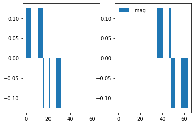


```python

```
